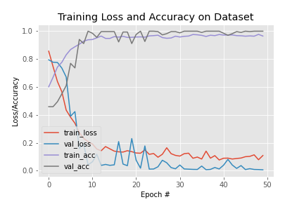

# Liveness Detection using MiniVGG

## Overview

This repository implements liveness detection using the MiniVGG neural network architecture. The MiniVGG net consists of two sets of CONV => RELU => CONV => RELU => POOL layers, followed by a set of FC => RELU => FC => SOFTMAX layers. The architecture includes batch normalization layers after activations and dropout layers (DO) after the POOL and FC layers.

## MiniVGG Architecture

The MiniVGG architecture is defined as follows:

- **Input Layer**: Accepts input frames for liveness detection.
- **Convolutional Layer 1**: 32 filters of size 3x3, followed by ReLU activation.
- **Convolutional Layer 2**: 32 filters of size 3x3, followed by ReLU activation and max-pooling (2x2, stride 2x2).
- **Convolutional Layer 3**: 64 filters of size 3x3, followed by ReLU activation.
- **Convolutional Layer 4**: 64 filters of size 3x3, followed by ReLU activation and max-pooling (2x2, stride 2x2).
- **Fully Connected Layer 1**: 128 neurons with ReLU activation and dropout.
- **Fully Connected Layer 2**: Output layer with softmax activation.

## Steps to Create Dataset

1. **Add Real and Fake Videos**: Record real videos using your phone to represent genuine interactions. Record fake videos to simulate liveness attacks. Make sure to vary lighting conditions and angles for a robust dataset.

2. **Use `collect_dataset` Script**: Utilize the provided script (`collect_dataset.py`) to organize the recorded videos into a structured dataset. This script will label the videos as real or fake and split them into training and testing sets.

## Training Dataset
**train.py**

## Training Plot

## Acknowledgments
The MiniVGG architecture is inspired by the original VGGNet [1].

[1] Simonyan, K., & Zisserman, A. (2014). Very Deep Convolutional Networks for Large-Scale Image Recognition. arXiv preprint arXiv:1409.1556.